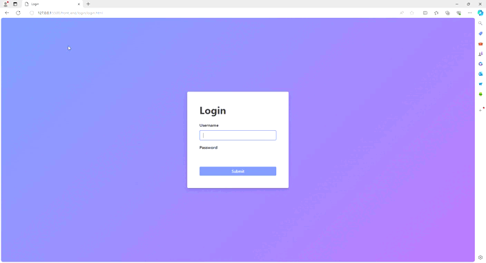

# Sitema de agendamento online

## Sobre

Este projeto foi desenvolvido para uma apresentação de projetos dentro do curso superior, porém, foi utilizado para aprimorar nossas habilidades com programação web e ferramentas de desenvolvimento.

## Layout

## Tecnologias Usadas

- Python
- Django Rest Framework
- JavaScript
- Bootstrap
- HTML
- CSS

## Como usar

Clone o repositório.

git clone https://github.com/LucasSobrinh0/projeto_agendamento

Crie um ambiente virtual no python: python -m venv env

Ative o ambiente virtual: env\Scripts\activate

Instale os requerimentos: pip install -r requirements.txt

Entre no diretório agendamento para migrar o banco de dados:

cd agendamento
 
python manage.py makemigrations
 
python manage.py migrate

PARA USAR A APLICAÇÃO, VOCÊ PRECISA ADICIONAR UM SUPER USUÁRIO ANTES:

cd agendamento

python manage.py createsuperuser

## Autor

Lucas Sobrinho Carneiro, Herick Magnom, Lucas Benencase

Linkedin: https://www.linkedin.com/in/lucas-sobrinho-c-b9b6661b9/

Email: lucas.sobrinho.crn@gmail.com
